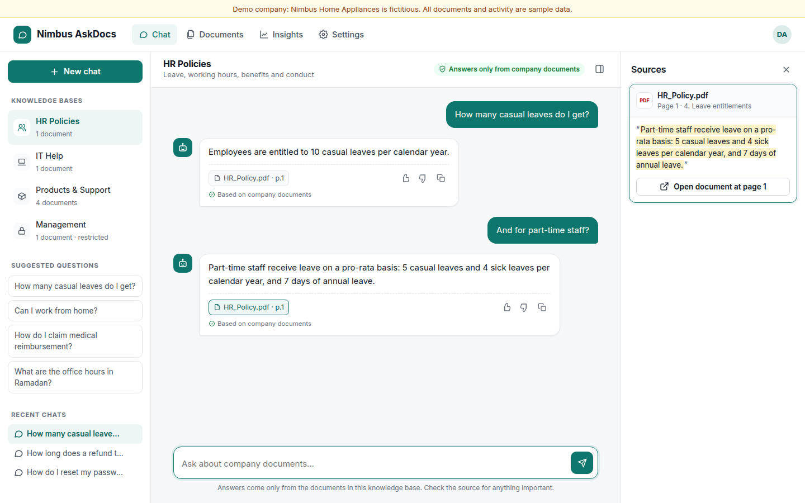
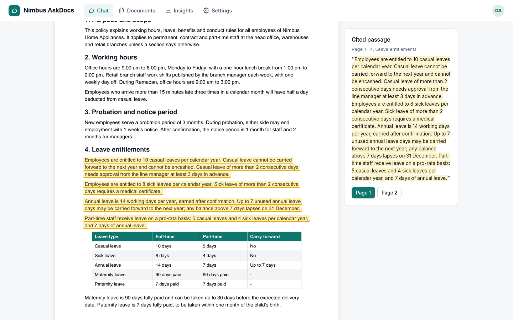
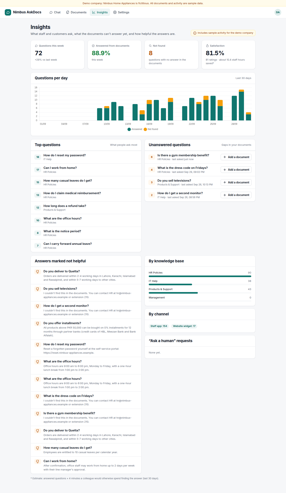
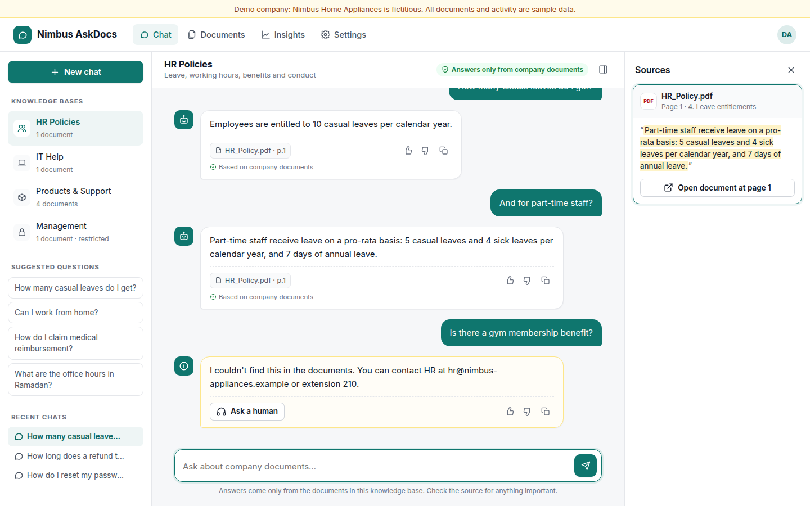
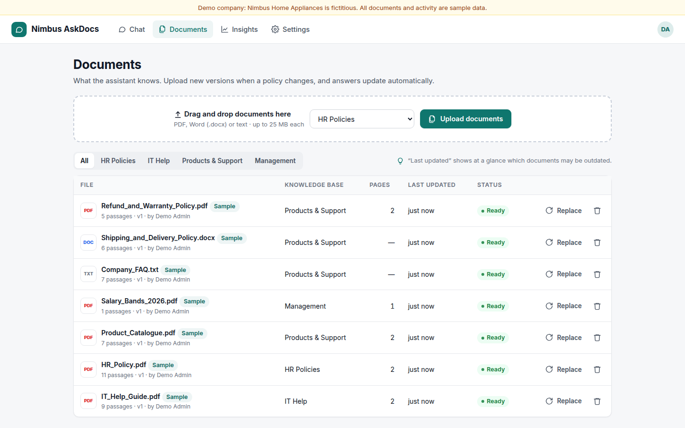
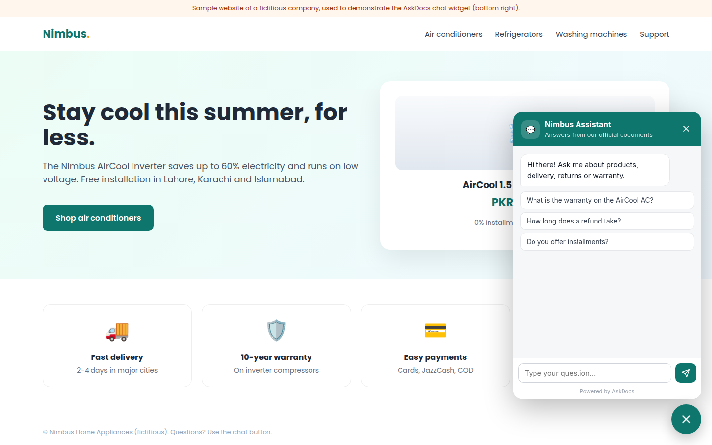
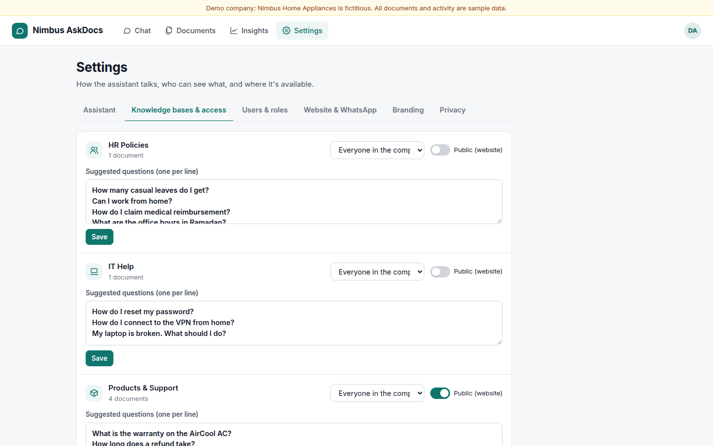
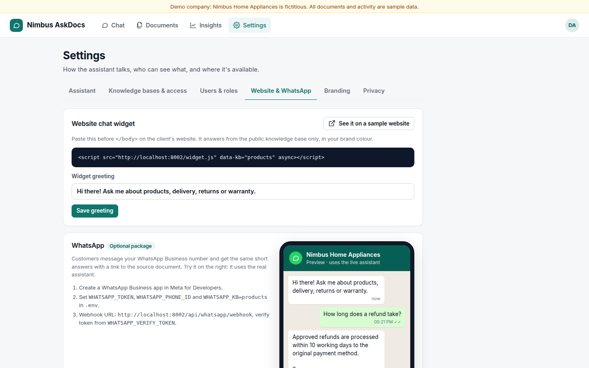
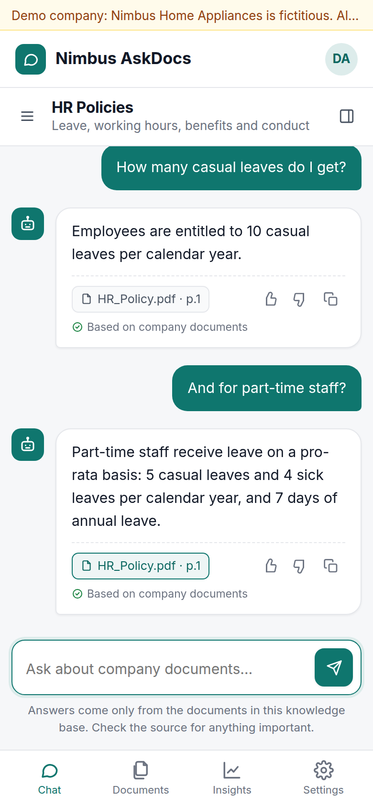

# AskDocs: RAG Chatbot on Company Documents

**A chatbot that knows your company's documents, answers from them, and always shows where the answer came from.**

### 🔗 Live demo: [askdocs.8-234-95-72.sslip.io](https://askdocs.8-234-95-72.sslip.io)
Open the link and click **Try the demo**, no sign-up needed.

It reads a company's PDFs, Word files, FAQs, policies and price lists. Staff or customers ask in plain language (English, Urdu or Roman Urdu) and get short answers with the source page. If the answer isn't in the documents, it says so instead of guessing.



## What it does

| | |
|---|---|
| **Answers with sources** | Every answer shows file and page chips; the side panel shows the exact passage; one click opens the document at that page with the passage highlighted |
| **Honest fallback** | "I couldn't find this in the documents. You can contact HR at …" plus an **Ask a human** button |
| **Understands follow-ups** | "How many casual leaves do I get?" → "And for part-time staff?" |
| **Search that understands meaning** | Hybrid search: keywords (BM25) + a small local embedding model, with Roman Urdu / Urdu keyword support |
| **Knowledge bases & access** | HR, IT, Products…; restricted ones (e.g. salary bands) visible only to chosen people, enforced on the server |
| **Admin documents screen** | Upload PDF/Word/text, replace with a new version, re-process, delete; "last updated" at a glance |
| **Insights** | Questions per day, top questions, unanswered questions with **Add a document**, satisfaction, not-helpful answers, handoff requests |
| **Website widget** | One `<script>` tag puts the assistant on any website in the client's colour (demo at `/demo-site`) |
| **WhatsApp (optional)** | Webhook for WhatsApp Cloud API + a live preview in Settings |
| **Settings** | Bot name, welcome message, tone, languages, fallback message, users & roles, branding, chat retention |

## Screens

| Chat | Opens the source | Insights |
|---|---|---|
|  |  |  |
| **Honest "not found"** | **Documents** | **Website widget** |
|  |  |  |
| **Access control** | **WhatsApp preview** | **Mobile** |
|  |  |  |

## Measured results

`scripts/evaluate.py` runs two question sets on the demo documents (offline mode, no AI key):

| | Held-out set (22 Qs) | Tuning set (48 Qs) |
|---|---|---|
| Correct answers | **88.9%** | 97.6% |
| Correct source document | 94.4% | 100% |
| Out-of-scope questions refused | 75% (3 of 4) | 85.7% |

The held-out set was written after tuning; its full history (66.7% → 83.3% → 88.9%) is explained in [docs/results.md](docs/results.md) along with every question and answer. **Quote the held-out numbers, and re-run the script with the client's own 30-50 questions before promising anything.** With a Groq key, run `python -m scripts.evaluate` again to measure AI answers.

## Quick start

```bash
./run.sh
```
Open http://localhost:8002 and click **Try the demo**. The first start downloads the search model (~70 MB) and loads the fictitious demo company (Nimbus Home Appliances: HR policy, IT guide, product catalogue, refund policy, shipping policy, FAQ, and a confidential salary-bands file).

- Demo login: `demo@askdocs.app` / `demo1234` (admin)
- Landing page: http://localhost:8002/landing
- Website widget on a sample company site: http://localhost:8002/demo-site
- Privacy & security: http://localhost:8002/privacy

## Answers: offline or AI (Groq, free)

| Mode | How answers are made | Needs |
|---|---|---|
| **Offline (default)** | Quotes the one or two sentences that best answer the question, from the top passages | Nothing |
| **AI** | Llama 3.3 70B on Groq writes a short answer **only from the retrieved passages**, with `[1]` citations, in the tone and language you set; replies `NOT_FOUND` when the passages don't answer it | Free key from https://console.groq.com/keys |

Put the key in `.env` as `GROQ_API_KEY=gsk_...` and restart. If Groq is unreachable or rate-limited, that answer automatically falls back to offline mode.

## Website widget

```html
<script src="https://YOUR-DOMAIN/widget.js" data-kb="products" async></script>
```
Only knowledge bases marked **Public** (Settings → Knowledge bases & access) can be used by the widget. The public endpoints are rate-limited.

## WhatsApp (optional package)

1. Create a WhatsApp Business app in Meta for Developers.
2. Set `WHATSAPP_TOKEN`, `WHATSAPP_PHONE_ID`, `WHATSAPP_KB=products` and `PUBLIC_BASE_URL` in `.env`.
3. Webhook URL: `https://YOUR-DOMAIN/api/whatsapp/webhook`, verify token = `WHATSAPP_VERIFY_TOKEN`.

## Free live demo links

### GitHub Codespaces (free, all features)

[](https://codespaces.new/daniyal-nawaz97/askdocs-rag-chatbot?quickstart=1)

1. Click the button above (or **Code → Codespaces → Create codespace on main**).
2. Wait about 3–5 minutes the first time while it installs; the app starts by itself on port 8002.
3. Open the **Ports** tab, check port 8002 shows **Public** (right-click → Port visibility → Public if not), and copy its address. It looks like `https://<name>-8002.app.github.dev`. Send that link to the client.

Free GitHub accounts get about 60 hours a month on a 2-core machine (30 hours of a running Codespace). A Codespace stops after 30 minutes without activity; **stop it yourself after the meeting** (Codespaces page → ⋯ → Stop) to save hours. Restarting it brings the same link back, with fresh demo data.

### Render (free, always available link, sleeps when idle)

[](https://render.com/deploy?repo=https://github.com/daniyal-nawaz97/askdocs-rag-chatbot)

1. Create a free account at https://render.com with **Sign in with GitHub** (no card needed for the free plan).
2. Click the button above. Render reads `render.yaml`, builds the Docker image and gives you a link like `https://askdocs.onrender.com` (or similar if taken).
3. Fill in the optional values it asks for (contact email/WhatsApp, Groq key); leave the rest empty.

The free plan sleeps after about 15 minutes without visitors; the first visit then takes about a minute to wake up. The demo data rebuilds itself on every start, so the demo is always clean.

## Deploying a live demo link

```bash
docker build -t askdocs .
docker run -p 8002:8002 -v $(pwd)/data:/app/data --env-file .env askdocs
```
The image downloads the search model at build time. On Render/Railway: Docker service, persistent disk at `/app/data`, add `GROQ_API_KEY` as an environment variable.

## Setting up for a client

1. **Documents**: create their knowledge bases (Settings → Knowledge bases) and upload their files; mark confidential ones as **Restricted**.
2. **Assistant**: bot name, welcome message, tone, languages, fallback message and human contact.
3. **Branding**: logo and colour (also used by the website widget).
4. **Users**: add their team as admins, editors (documents + insights) or members (chat).
5. **Test**: put 30 of their real questions with answers into `scripts/eval_questions_holdout.json` and run `python -m scripts.evaluate`.
6. Remove the demo account (`DEMO_EMAIL`) for a private install.

## Project structure

```
app/
  main.py      Routes: auth, knowledge bases, documents, chat (streaming), insights, settings, widget, WhatsApp
  ingest.py    PDF / Word / text → passages that remember page, heading and position (for highlighting)
  search.py    Hybrid search (BM25 + local embeddings), Roman Urdu/Urdu terms, follow-up handling
  answer.py    Offline quoted answers or Groq answers with citations; "not found" logic
  seed.py      Demo company, users, access rules, sample activity (marked as sample)
static/        Single-page app, website widget (widget.js / widget.html), sample website, landing, privacy
scripts/       make_samples.py, evaluate.py (+ question sets), record_demo.py
docs/          Case study, pitch, demo script, one-pager, onboarding, pricing, results, screenshots, demo video
```

## Client materials (in `docs/`)

[Demo video](docs/demo.mp4) · [One-page PDF](docs/one-pager.pdf) · [Case study](docs/case-study.md) · [Pitch & outreach](docs/pitch-and-outreach.md) · [Demo script](docs/demo-video-script.md) · [Pricing](docs/pricing.md) · [Onboarding & handover](docs/onboarding-and-handover.md) · [Sample questions to inspire clients](docs/sample-questions.md) · [Measured results](docs/results.md)

## Honest limits (tell clients upfront)

- It can only answer from what is in the documents.
- Poorly scanned documents and complex tables may need cleanup (scanned PDFs without a text layer are rejected with a clear message).
- Outdated documents mean outdated answers: keep versions current (Replace button).
- Accuracy is measured, not perfect; the source links let people verify.
